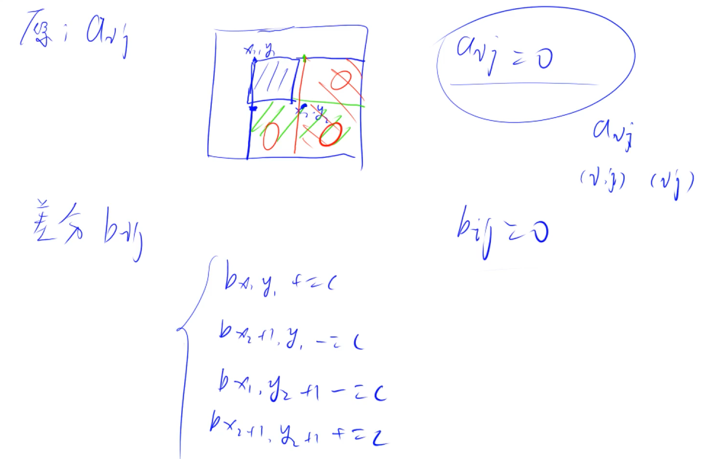
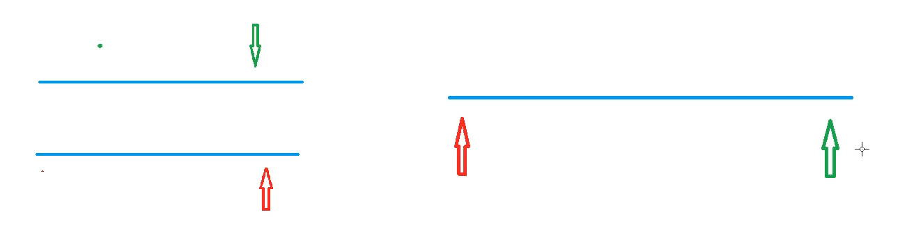
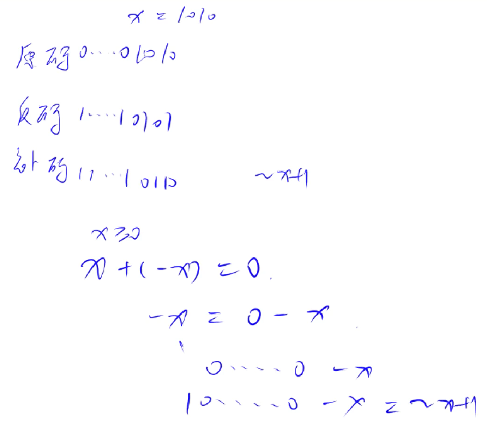

# 算法（基础）

## 排序 (Sort)

### 概述

C++ 标准库中的 `std::sort()` 使用的是 **IntroSort**（内省排序）。  

→ **IntroSort 结合了三种排序算法：**

1. **快速排序（QuickSort）**：大多数情况下使用，平均时间复杂度 `O(n log n)`。
2. **堆排序（HeapSort）**：当递归深度超过 `log(n)`（防止最坏情况退化），切换为 `O(n log n)` 的堆排序。
3. **插入排序（InsertionSort）**：当数组很小（一般 `n ≤ 16`），使用 `O(n²)` 的插入排序提高局部性能。

→ **IntroSort = QuickSort + HeapSort + InsertionSort**

### 常用的排序算法

| 排序算法 | 最优 | 平均 | 最坏 | 空间复杂度 | 稳定性 | 适用场景 |
|----------|------|------|------|----------|------|---------|
| 快速排序 (QuickSort) | $O(n \log n)$ | $O(n \log n)$ | $O(n²)$ | $O(\log n)$ | 不稳定 | 适用于大规模无序数据，默认 `std::sort()` |
| 堆排序 (HeapSort) | $O(n \log n)$ | $O(n \log n)$ | $O(n \log n)$ | $O(1)$ | 不稳定 | 适用于需要 $O(1)$ 额外空间 |
| 归并排序 (MergeSort) | $O(n \log n)$ | $O(n \log n)$ | $O(n \log n)$ | $O(n)$ | 稳定 | 适用于链表排序或稳定性要求高的情况 |
| 插入排序 (InsertionSort) | $O(n)$ | $O(n²)$ | $O(n²)$ | $O(1)$ | 稳定 | 适用于小规模数据或几乎有序数据 |
| 冒泡排序 (BubbleSort) | $O(n)$ | $O(n²)$ | $O(n²)$ | $O(1)$ | 稳定 | 仅用于教学，实际应用很少 |
| 选择排序 (SelectionSor) | $O(n²)$ | $O(n²)$ | $O(n²)$ | $O(1)$ | 不稳定 | 适用于不在意稳定性的简单排序 |


### 不稳定排序

#### [快速排序 (Quick Sort)](code/quick-sort.cpp)

### 稳定排序

#### [桶排序 (Heap Sort)](code/heap-sort.cpp)

#### [插入排序 (Insertion Sort)](code/insertion-sort.cpp)

#### [归并排序 (Merge Sort)](code/merge-sort.cpp)

## 二分 (Binary)

### 整数 (Integer)

```cpp
bool check(int x) {
    // ...
}
int binary_search_integer(int l, int r) {
    while (l < r) {
        int mid = (l + r) >> 1;
        if (check(mid)) {
            r = mid;
        } else {
            l = mid + 1;
        }
    }
    // 注意返回左端点
    return l;
}
```

### 浮点数 (Decimal)

```cpp
bool check(int x) {
    // ...
}
double binary_search_decimal(double l, double r) {
    // 精度要求
    const double eps = 1e-6;
    while (r - l > eps) {
        double mid = (l + r) / 2;
        if (check(mid)) {
            r = mid;
        } else {
            l = mid;
        }
    }
    return l;
}
```

## 高精度 (Arbitrary Precision)

### 1. 高精度加单精度

```cpp
// string num;
// int x, len;
// int a[105];
len = num.size();
for (int i = 0; i < len; i++) {
    a[i] = num[len - 1 - i] - '0';
}
a[0] += x;
for (int i = 0; i < len; i++) {
    a[i + 1] += a[i] / 10;
    a[i] %= 10;
}
while (a[len]) {
    a[len + 1] += a[len] / 10;
    a[len] %= 10;
    len++;
}
for (int i = len - 1; i >= 0; i--) {
    cout << a[i];
}
```

### 2. 高精度加高精度

```cpp
// string num1, num2;
// int a1[105], a2[105], len1, len2;
len1 = num1.size();
for (int i = 0; i < len1; i++) {
    a1[i] = num1[len1 - 1 - i] - '0';
}
len2 = num2.size();
for (int i = 0; i < len2; i++) {
    a2[i] = num2[len2 - 1 - i] - '0';
}
len1 = max(len1, len2);
for (int i = 0; i < len1; i++) {
    a1[i] += a2[i];
}
for (int i = 0; i < len1; i++) {
    a1[i + 1] += a1[i] / 10;
    a1[i] %= 10;
}
while (a1[len1]) {
    a1[len1 + 1] += a1[len1] / 10;
    a1[len1] %= 10;
    len1++;
}
for (int i = len1 - 1; i >= 0; i--) {
    cout << a1[i];
}
```

> ↓↓ 引用 [AcWing](https://www.acwing.com/blog/content/277/) 中的写法 ↓↓

```cpp
// C = A + B, 满足 A >= 0, B >= 0.
vector<int> add(vector<int> &A, vector<int> &B) {
    if (A.size() < B.size()) return add(B, A);

    vector<int> C;
    int t = 0;
    for (int i = 0; i < A.size(); i++) {
        t += A[i];
        if (i < B.size()) {
            t += B[i];
        }
        C.push_back(t % 10);
        t /= 10;
    }

    if (t) {
        C.push_back(t);
    }
    return C;
}
```

### 3. 高精度减单精度

```cpp
// string num;
// int x, len;
// int a[105];
len = num.size();
for (int i = 0; i < len; i++) {
    a[i] = num[len - 1 - i] - '0';
}
a[0] -= x;
for (int i = 0; i < len; i++) {
    while (a[i] < 0) {
        a[i + 1]--;
        a[i] += 10;
    }
}
while (len > 1 && a[len - 1] == 0) {
    len--;
}
for (int i = len - 1; i >= 0; i--) {
    cout << a[i];
}
```

### 4. 高精度减高精度

```cpp
// string num1, num2;
// int a1[105], a2[105], len1, len2;
// bool sgn;
// bool cmp(string a, string b) {
//     if (a.size() != b.size()) {
//         return a.size() < b.size();
//     }
//     return a < b;
// }
if (cmp(num1, num2)) {
    sgn = true;
    swap(num1, num2);
}
len1 = num1.size();
for (int i = 0; i < len1; i++) {
    a1[i] = num1[len1 - 1 - i] - '0';
}
len2 = num2.size();
for (int i = 0; i < len2; i++) {
    a2[i] = num2[len2 - 1 - i] - '0';
}
for (int i = 0; i < len1; i++) {
    a1[i] -= a2[i];
}
for (int i = 0; i < len1; i++) {
    while (a1[i] < 0) {
        a1[i + 1]--;
        a1[i] += 10;
    }
}
while (len1 > 1 && a1[len1 - 1] == 0) {
    len1--;
}
if (sgn) {
    cout << "-";
}
for (int i = len1 - 1; i >= 0; i--) {
    cout << a1[i];
}
```

> ↓↓ 引用 [AcWing](https://www.acwing.com/blog/content/277/) 中的写法 ↓↓

```cpp
// C = A - B, 满足 A >= B, A >= 0, B >= 0.
vector<int> sub(vector<int> &A, vector<int> &B) {
    vector<int> C;
    for (int i = 0, t = 0; i < A.size(); i++) {
        t = A[i] - t;
        if (i < B.size()) {
            t -= B[i];
        }
        C.push_back((t + 10) % 10);
        t = t < 0 ? 1 : 0;
    }

    while (C.size() > 1 && C.back() == 0) C.pop_back();
    return C;
}
```

### 5. 高精度乘以单精度

```cpp
// string num;
// int x, len;
// int a[105];
len = num.size();
for (int i = 0; i < len; i++) {
    a[i] = num[len - 1 - i] - '0';
}
for (int i = 0; i < len; i++) {
    a[i] *= x;
}
for (int i = 0; i < len; i++) {
    a[i + 1] += a[i] / 10;
    a[i] %= 10;
}
while (a[len]) {
    a[len + 1] += a[len] / 10;
    a[len] %= 10;
    len++;
}
for (int i = len - 1; i >= 0; i--) {
    cout << a[i];
}
```

> ↓↓ 引用 [AcWing](https://www.acwing.com/blog/content/277/) 中的写法 ↓↓

```cpp
// C = A * b, 满足 A >= 0, b >= 0.
vector<int> mul(vector<int> &A, int b) {
    vector<int> C;

    int t = 0;
    for (int i = 0; i < A.size() || t; i++) {
        if (i < A.size()) {
            t += A[i] * b;
        }
        C.push_back(t % 10);
        t /= 10;
    }

    while (C.size() > 1 && C.back() == 0) C.pop_back();

    return C;
}
```

### 6. 高精度乘以高精度

```cpp
// string num1, num2;
// int a1[105], a2[105], len1, len2, a[205], len;
len1 = num1.size();
for (int i = 0; i < len1; i++) {
    a1[i] = num1[len1 - 1 - i] - '0';
}
len2 = num2.size();
for (int i = 0; i < len2; i++) {
    a2[i] = num2[len2 - 1 - i] - '0';
}
for (int i = 0; i < len1; i++) {
    for (int j = 0; j < len2; j++) {
        a[i + j] += a1[i] * a2[j];
    }
}
len = len1 + len2 - 1;
for (int i = 0; i < len; i++) {
    a[i + 1] += a[i] / 10;
    a[i] %= 10;
}
while (a[len]) {
    a[len + 1] += a[len] / 10;
    a[len] %= 10;
    len++;
}
for (int i = len - 1; i >= 0; i--) {
    cout << a[i];
}
cout << endl;
```

### 7. 高精度乘以单精度

> ↓↓ 引用 [AcWing](https://www.acwing.com/blog/content/277/) 中的写法 ↓↓

```cpp
// A / b = C ... r, 满足 A >= 0, b > 0.
vector<int> div(vector<int> &A, int b, int &r) {
    vector<int> C;
    r = 0;
    for (int i = A.size() - 1; i >= 0; i--) {
        r = r * 10 + A[i];
        C.push_back(r / b);
        r %= b;
    }
    reverse(C.begin(), C.end());
    while (C.size() > 1 && C.back() == 0) C.pop_back();
    return C;
}
```

## 简单数学问题

### 1. 判断质数

```cpp
// int n;
// cin >> n;
bool is_prime = true;
if (n == 1) {
    is_prime = false;
}
for (int i = 2; i * i <= n; i++) {
    if (n % i == 0) {
        is_prime = false;
        break;
    }
}
// return is_prime;
```

### 2. 求因数个数

```cpp
// int n;
// cin >> n;
// 注意 i 的范围是到根号 n
// 完全平方数 exponent 等于 0 不需要多考虑
int count = 1;
for (int i = 2; i * i <= n; i++) {
    if (n % i == 0) {
        cout << i << " ";
        int exponent = 0;
        while (n % i == 0) {
            n /= i;
            exponent++;
        }
        count *= (exponent + 1);
    }
}
// 如果 n 仍然是一个大于 1 的质数
// 它自身（最后剩下的质数）也是一个质因数
count = (n == 1 ? count : count * 2);
cout << count;
// return cnt;
```

### 3. [求最大公因数与最小公倍数](code/gcd-lcm.cpp)

### 4. 实现阶乘取模

```cpp
const int mod = 1000000007;
int fac[1000005];

int n;
cin >> n;
fac[0] = 1;
for (int i = 1; i <= n; i++) {
    fac[i] = 1LL * fac[i - 1] * i % mod;
}
cout << fac[n] << endl;
```

### 5. 实现进制转换

$(n)_{10} = (s)_a \rightarrow (t)_b$

## 前缀和 (Prefix Sum)

### 一维前缀和

```cpp
void build_PrefixSum_1D() {
    for (int i = 1; i <= n; i++) {
        sum[i] = sum[i - 1] + arr[i];
    }
}
// 查询区间 [l, r] 的和
int query(int l, int r) {
    return sum[r] - sum[l - 1];
}
```

### 二维前缀和

```cpp
void build_PrefixSum_2D() {
    for (int i = 1; i <= m; i++) {
        for (int j = 1; j <= n; j++) {
            sum[i][j] = arr[i][j] + sum[i - 1][j] + sum[i][j - 1] - sum[i - 1][j - 1];
        }
    }
}
// 查询子矩阵 [(x1, y1), (x2, y2)]
int query(int x1, int y1, int x2, int y2) {
    return sum[x2][y2] - sum[x1 - 1][y2] - sum[x2][y1 - 1] + sum[x1 - 1][y1 - 1];
}
```

## 差分 (Difference)

### 一维差分

适用于 **快速进行区间修改**，然后 **通过前缀和恢复最终数组**。

- 差分数组构造：$$b[i] = a[i] - a[i-1]$$
- 区间修改：对区间 $[l, r]$ 加上 $x$，更新：$$b[l] += x, \quad b[r+1] -= x$$
- 最终恢复原数组：$$a[i] = b[1] + b[2] + ... + b[i]$$

```cpp
void build_Difference_1D() {
    for (int i = 1; i <= n; i++) {
        diff[i] = arr[i] - arr[i - 1];
    }
}
// 对区间 [l, r] 加 x
void update(int l, int r, int x) {
    diff[l] += x;
    diff[r + 1] -= x;
}
// 计算最终数组
void rebuildArray() {
    for (int i = 1; i <= n; i++) {
        arr[i] = arr[i - 1] + diff[i];
    }
}
```

### 二维差分

适用于 **矩形区域修改**，然后 **通过前缀和恢复最终矩阵**。

- 进行矩形更新：$$d[x_1][y_1] += v, \quad d[x_2+1][y_1] -= v, \quad d[x_1][y_2+1] -= v, \quad d[x_2+1][y_2+1] += v$$
- 最终恢复原矩阵：$$a[i][j] = d[1][1] + \text{Prefix Sum}$$

```cpp
void build_Difference_2D() {
    for (int i = 1; i <= m; i++) {
        for (int j = 1; j <= n; j++) {
            diff[i][j] = arr[i][j] - arr[i - 1][j] - arr[i][j - 1] + arr[i - 1][j - 1];
        }
    }
}
// 对子矩阵 [(x1, y1), (x2, y2)] 加 v
void update(int x1, int y1, int x2, int y2, int v) {
    diff[x1][y1] += v;
    diff[x2 + 1][y1] -= v;
    diff[x1][y2 + 1] -= v;
    diff[x2 + 1][y2 + 1] += v;
}
// 计算最终矩阵
void rebuildArray() {
    for (int i = 1; i <= m; i++) {
        for (int j = 1; j <= n; j++) {
            arr[i][j] = diff[i][j] + arr[i - 1][j] + arr[i][j - 1] - arr[i - 1][j - 1];
        }
    }
}
```

---

| 类型 | 预处理 | 单次查询 | 单次修改 |
|------|--------|--------|--------|
| **一维前缀和** | \( O(n) \) | \( O(1) \) | \( O(n) \) |
| **二维前缀和** | \( O(mn) \) | \( O(1) \) | \( O(mn) \) |
| **一维差分** | \( O(n) \) | \( O(n) \) | \( O(1) \) |
| **二维差分** | \( O(mn) \) | \( O(mn) \) | \( O(1) \) |

---



---

## 双指针 (Two Pointers)



常见问题分类：

1. 对于一个序列，用两个指针维护一段区间
2. 对于两个序列，维护某种次序，比如归并排序中合并两个有序序列的操作

$O(n^2) \rightarrow O(n)$

```cpp
for (int l = 0, r = 0; r < n; r++) {
    while (l <= r && check(i, j)) {
        l++;
    }
    // ...
    // ans = max(ans, r - l + 1);
}
```

- [ ] 右指针递增写法

## 二进制（按）位运算 (Binary Bitwise Operations)

### 简介

二进制位运算（Bitwise Operations）是一种直接在整数的二进制位上进行操作的方式，通常用于底层编程，如性能优化、加密算法、图像处理等。

| 运算 | 运算符 | 数学符号表示 | 解释 |
|---|:---:|-------------------|:------------------------------:|
| 与 | `&` | $\&$、$\operatorname{and}$ | 只有两个对应位都为 $1$ 时才为 $1$ |
| 或 | `\|` | $\mid$、$\operatorname{or}$ | 只要两个对应位中有一个 $1$ 时就为 $1$ |
| 异或 | `^` | $\oplus$、$\operatorname{xor}$ | 只有两个对应位不同时才为 $1$ |

1. 原码

    最高位作为符号位。

    0 $\to$ +（正数）

    1 $\to$ -（负数）

    其余各位代表数值本身的绝对值（以二进制表示）。

2. 反码

    最高位位置为 1。

    其余各位为原码的相应数据按位取反。

3. 补码

    最高位位置为 1。

    其余各位为原码的相应数据按位取反，然后再在对整个数加1。

P.S.

- 正整数的原码、反码、补码相同。

- 数字 0 的原码、反码不唯一，补码唯一。



### 常见的位运算

| 运算符 | 说明 | 示例（假设 `a = 5`，`b = 3`）|
|--------|------|----------------|
| `&` (按位与) | 只有两个对应位都为 `1`，结果才为 `1` | `5 & 3 = 1` (`0101 & 0011 = 0001`) |
| `\|` (按位或) | 只要任意一位为 `1`，结果就为 `1` | `5 \| 3 = 7` (`0101 \| 0011 = 0111`) |
| `^` (按位异或) | 仅当两个对应位不同，结果才为 `1` | `5 ^ 3 = 6` (`0101 ^ 0011 = 0110`) |
| `~` (按位取反) | `0` 变 `1`，`1` 变 `0`，即对整个数取反 | `~5 = -6` (`~00000101 = 11111010`，补码表示) |
| `<<` (左移) | 所有位向左移动 `n` 位，右侧补 `0` | `5 << 1 = 10` (`0101 << 1 = 1010`) |
| `>>` (右移) | 所有位向右移动 `n` 位，左侧补 `0`（或补 `1` 取决于符号位） | `5 >> 1 = 2` (`0101 >> 1 = 0010`) |

---

### 实现二进制位运算

```cpp
    int a = 5, b = 3; // a = 0101, b = 0011
    std::cout << "a & b = " << (a & b) << std::endl; // 1  (0001)
    std::cout << "a | b = " << (a | b) << std::endl; // 7  (0111)
    std::cout << "a ^ b = " << (a ^ b) << std::endl; // 6  (0110)

    int a = 5; // 00000101
    std::cout << "~a = " << (~a) << std::endl; // -6 (补码表示)

    int a = 5; // 00000101
    std::cout << "a << 1 = " << (a << 1) << std::endl; // 10 (00001010)
    std::cout << "a >> 1 = " << (a >> 1) << std::endl; // 2  (00000010)
```

- **左移 (`<< n`)** 相当于 `a * 2^n`。
- **右移 (`>> n`)** 相当于 `a / 2^n`，如果 `a` 是负数，行为可能依赖编译器（算术右移或逻辑右移）。

### 操作一个数的二进制位

```cpp
获取一个数二进制的某一位：
// 获取 a 的第 b 位，最低位编号为 0
int getBit(int a, int b) { return (a >> b) & 1; }

将一个数二进制的某一位设置为 0：
// 将 a 的第 b 位设置为 0 ，最低位编号为 0
int unsetBit(int a, int b) { return a & ~(1 << b); }

将一个数二进制的某一位设置为 1：
// 将 a 的第 b 位设置为 1 ，最低位编号为 0
int setBit(int a, int b) { return a | (1 << b); }

将一个数二进制的某一位取反：
// 将 a 的第 b 位取反 ，最低位编号为 0
int flapBit(int a, int b) { return a ^ (1 << b); }
```

```cpp
// 二进制中 1 的个数
int countOnes(int x) {
    int count = 0;
    while (x) {
        x -= lowbit(x);
        count++;
    }
    return count;
}
// 树状数组
```

## [离散化 (Discretization)](code/coordinate-compressor.cpp)

## [区间合并 (Merge Intervals)](code/merge-intervals.cpp)
