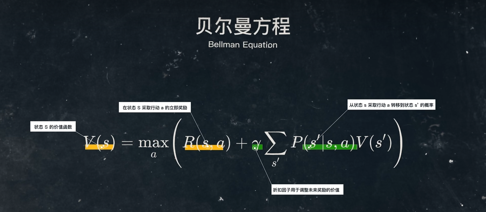
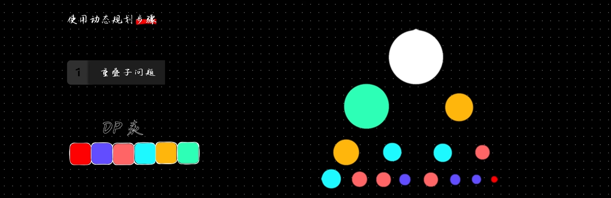
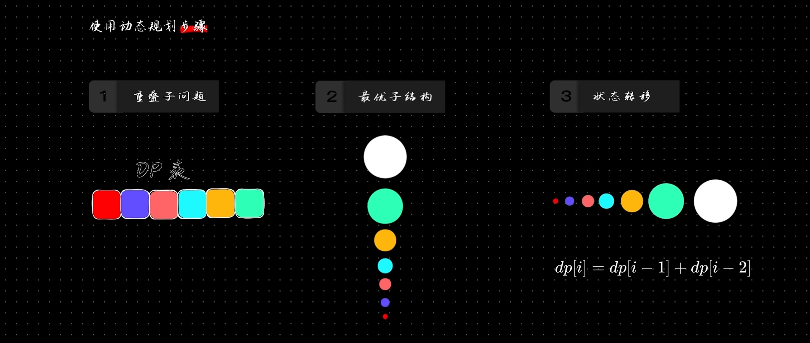
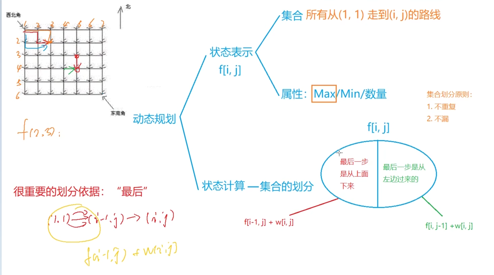
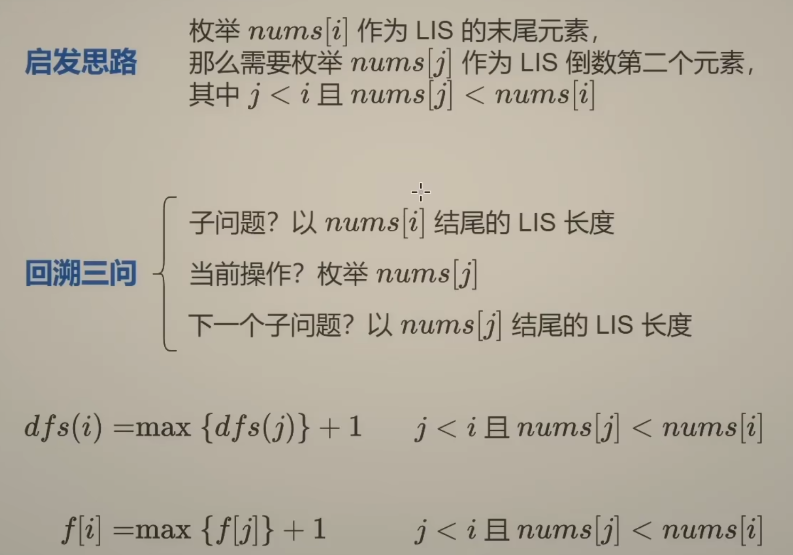
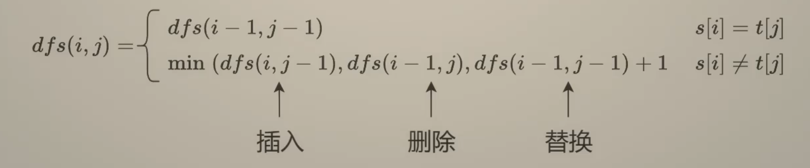
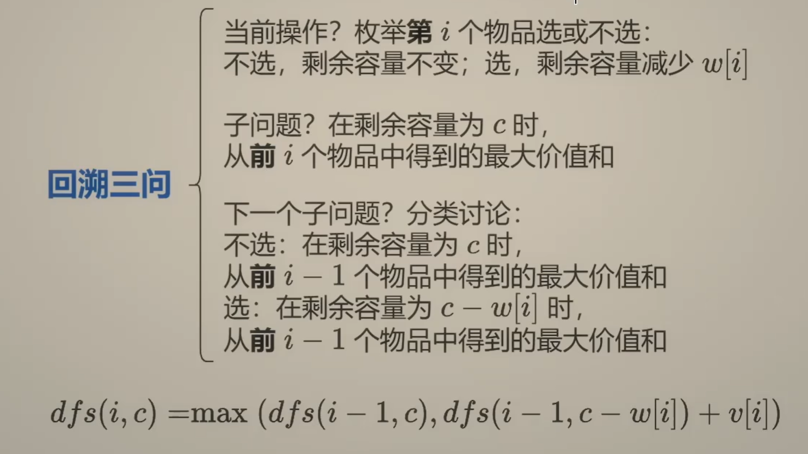

# 动态规划（基础）

## 动态规划的基本概念

- **阶段**：把所给问题的求解过程恰当地分成若干个相互联系的阶段，以便于求解。过程不同，阶段数就可能不同。描述阶段的变量称为阶段变量，常用 $k$ 表示。阶段的划分，一般是根据时间和空间的自然特征来划分，但要便于把问题的过程转化为多阶段决策的过程。

- **状态**：状态表示每个阶段开始面临的自然状况或客观条件，它不以人们的主观意志为转移，也称为不可控因素。通常一个阶段有若干个状态，状态通常可以用一个或一组数来描述，称为状态变量。

- **决策**：表示当过程处于某一阶段的某个状态时，可以做出不同的决定，从而确定下一阶段的状态，这种决定称为决策。不同的决策对应着不同的数值，描述决策的变量称决策变量。

- **状态转移方程**：动态规划中本阶段的状态往往是上一阶段的状态和上一阶段的决策的结果，由第 $i$ 段的状态 $f(i)$ 和决策 $u(i)$ 来确定第 $i+1$ 段的状态。状态转移表示为 $F(i+1)=T(f(i),u(i))$ ，称为状态转移方程。

- **策略**：各个阶段决策确定后，整个问题的决策序列就构成了一个策略，对每个实际问题，可供选择的策略有一定范围，称为允许策略集合。允许策略集合中达到最优效果的策略称为最优策略。

## 动态规划必须满足最优化原理与无后效性

- **最优化原理**：“一个过程的最优决策具有这样的性质：即无论其初始状态和初始决策如何，其今后诸策略对以第一个决策所形成的状态作为初始状态的过程而言，必须构成最优策略”。也就是说一个最优策略的子策略，也是最优的。

- **无后效性**：如果某阶段状态给定后，则在这个阶段以后过程的发展不受这个阶段以前各个状态的影响。

---



转移方程简化：$$f(P)=\max/\min\{f(R)+w_{R\to{P}}\}$$




> 图片截取于：[《算法图解》chapter 09 - 动态规划](https://www.bilibili.com/video/BV1Mu4y1k7T8) 作者：[修鸿up](https://space.bilibili.com/472759461)

闫氏分析法：



> 图片截取于：[闫氏DP分析法，从此再也不怕DP问题！](https://www.bilibili.com/video/BV1X741127ZM) 作者：[大雪菜](https://space.bilibili.com/7836741)

---

## 最长上升子序列和最大子段和

1.实现最大字段和

```cpp
for (int i = 1; i <= n; i++) {
    f[i] = (f[i - 1] >= 0 ? f[i - 1] + a[i] : a[i]);
    ans = max(ans, f[i]);
}
```

2.最大子段和的空间优化

```cpp
for (int i = 1; i <= n; i++) {
    sum = (sum >= 0 ? sun + a[i] : a[i])
    ans = max(ans, sum);
}
```

3.最长上升子序列



> 图片截取于：[最长递增子序列【基础算法精讲 20】](https://www.bilibili.com/video/BV1ub411Q7sB) 作者：[灵茶山艾府](https://space.bilibili.com/206214)

$$ dp[i]\gets\max\{dp[i],\ dp[j]+1\}\quad 1\le j<i\ \&\&\ a[j]<a[i] $$

```cpp
for (int i = 1; i <= n; i++) {
    dp[i] = 1;
    for (int j = 1; j < i; j++) {
        if (a[j] < a[i]) {
            dp[i] = max(dp[i], dp[j] + 1);
        }
    }
    ans = max(ans, dp[i]);
}
```

4.最大子矩阵和

```cpp
for (int i = 1; i <= n; i++) {
    for (int j = 1; j <= m; j++) {
        ans = max(ans, num[i][j]);
    }
}
if (ans <= 0) {
    cout << ans << endl;
} else {
    for (int i = 1; i <= n; i++) {
        for (int j = 1; j <= m; j++) {
            presum[i][j] = presum[i - 1][j] + num[i][j];
        }
    }
    for (int i = 1; i <= n; i++) {
        for (int j = i; j <= n; j++) {
            sum = 0;
            for (int k = 1; k <= m; k++) {
                if (sum + presum[j][k] - presum[i - 1][k] < 0) {
                    sum = 0;
                } else {
                    sum += presum[j][k] - presum[i - 1][k];
                }
                ans = max(ans, sum);
            }
        }
    }
    cout << ans << endl;
}
```

5.环状矩阵

```cpp
for (int i = 1; i <= n; i++) {
    for (int j = 0; j < m; j++) {
        ans = max(ans, num[i][j]);
    }
}
if (ans <= 0) {
    cout << ans << endl;
} else {
    for (int i = 1; i <= n; i++) {
        for (int j = 0; j < m; j++) {
            sum[i][j] = sum[i - 1][j] + num[i][j];
        }
    }
    for (int i = 1; i <= n; i++) {
        for (int j = 1; j <= n; j++) {
            for (int k = 0; k < m; k++) {
                nowsum = 0;
                for (int l = 0; l < m; l++) {
                    if (i <= j) {
                        t = sum[j][(k + l) % m] - sum[i - 1][(k + l) % m];
                    } else {
                        t = sum[n][(k + l) % m] - (sum[i - 1][(k + l) % m] - sum[j][(k + l) % m]);
                    }
                    if (nowsum + t <= 0) {
                        nowsum = 0;
                    } else {
                        nowsum += t;
                    }
                    ans = max(ans, nowsum);
                }
            }
        }
    }
    cout << ans << endl;
}
```

6.删除最少的元素

```cpp
for (int i = 0; i < n; i++) {
    dp[0][i] = 1;
    for (int j = 0; j < i; j++) {
        if (a[j] >= a[i]) {
            dp[0][i] = max(dp[0][i], dp[0][j] + 1);
        }
    }
}
for (int i = n - 1; i >= 0; i--) {
    dp[1][i] = 1;
    for (int j = n - 1; j > i; j--) {
        if (a[j] >= a[i]) {
            dp[1][i] = max(dp[1][i], dp[1][j] + 1);
        }
    }
}
for (int i = 0; i < n; i++) {
    ans = max(ans, dp[0][i] + dp[1][i] - 1);
}
cout << n - ans << endl;
```

---

## 最长公共子序列和编辑距离

1-0.实现最长公共子序列

```cpp
#include <iostream>
#include <cstring>
#include <string>
using namespace std;
int dp[110][110];
int main() {
    string a,b;
    cin >> a >> b;
    int lena = a.size();
    int lenb = b.size();
    for (int i = 1; i <= lena; i++) {
        for (int j = 1; j <= lenb; j++) {
            if (a[i - 1] == b[j - 1]) {
                dp[i][j] = dp[i - 1][j - 1] + 1;
            } else {
                dp[i][j] = max(dp[i - 1][j], dp[i][j - 1]);
            }
        }
    }
    cout << dp[lena][lenb] << endl;
    return 0;
}
```

1-1.最长公共子序列 II

```cpp
#include <iostream>
#include <cstring>
using namespace std;
int dp[2][10001];
string a, b;
int main() {
    string a, b;
    cin >> a >> b;
    int flag = 1, n = a.size(), m = b.size();
    for (int i = 1; i <= n; i++) {
        for (int j = 1; j <= m; j++) {
            if (a[i - 1] == b[j - 1]) {
                dp[flag][j] = dp[1 - flag][j - 1] + 1;
            } else {
                dp[flag][j] = max(dp[1 - flag][j], dp[flag][j - 1]);
            }
        }
        flag = 1 - flag;
    }
    cout << dp[1 - flag][m] << endl;
    return 0;
}
```

2.实现编辑距离



> 图片截取于：[最长公共子序列 编辑距离【基础算法精讲 19】](https://www.bilibili.com/video/BV1TM4y1o7ug) 作者：[灵茶山艾府](https://space.bilibili.com/206214)

```cpp
#include <iostream>
#include <string>
using namespace std;
int dp[110][110];
string a, b;
int main() {
    cin >> a >> b;
    int lena = a.size();
    int lenb = b.size();
    for (int i = 1; i <= lena; i++) {
        dp[i][0] = i;
    }
    for (int i = 1; i <= lenb; i++) {
        dp[0][i] = i;
    }
    for (int i = 1; i <= lena; i++) {
        for (int j = 1; j <= lenb; j++) {
            if (a[i] == b[j]) {
                dp[i][j] = dp[i - 1][j - 1];
            } else {
                dp[i][j] = min(min(dp[i][j - 1], dp[i - 1][j]), dp[i - 1][j - 1]) + 1;
            }
        }
    }
    cout << dp[lena][lenb] << endl;
    return 0;
}
```

---

## [背包九讲](doc/背包问题九讲V2.pdf)

> 项目地址：[pack](https://github.com/tianyicui/pack) 作者：[崔添翼](https://github.com/tianyicui)

## 基础背包问题

### 01 背包



> > 图片截取于：[0-1背包 完全背包【基础算法精讲 18】](https://www.bilibili.com/video/BV16Y411v7Y6) 作者：[灵茶山艾府](https://space.bilibili.com/206214)

$$F[i, v] = \max\{F[i-1,v],\ F[i-1,v-C_i]+W_i\}$$
$$F[v] \gets \max\{F[v],\ F[v-C_i]+W_i\}$$

#### 1. 实现 01 背包

```cpp
#include <iostream>
#include <cstring>
#include <algorithm>
using namespace std;
int dp[21][1010];
int w[21], c[21];
int main() {
    int N, V;
    cin >> N >> V;
    for (int i = 1; i <= N; i++) {
        cin >> w[i] >> c[i];
    }
    for (int i = 1; i <= N; i++) {
        for (int j = 0; j <= V; j++) {
            if (j >= c[i]) {
                dp[i][j] = max(dp[i - 1][j - c[i]] + w[i], dp[i - 1][j]);
            } else {
                dp[i][j] = dp[i - 1][j];
            }
        }
    }
    cout << dp[N][V] << endl;
    return 0;
}
```

#### 2. 实现 01 背包空间优化（滚动数组）

```cpp
#include <iostream>
#include <cstring>
#include <algorithm>
using namespace std;
int dp[2][1010];
int w[21], c[21];
int main() {
    int N, V;
    cin >> N >> V;
    for (int i = 1; i <= N; i++) {
        cin >> w[i] >> c[i];
    }
    int flag = 1;
    for (int i = 1; i <= N; i++) {
        for (int j = 0; j <= V; j++) {
            if (j >= c[i]) {
                dp[flag][j] = max(dp[1 - flag][j - c[i]] + w[i], dp[1 - flag][j]);
            } else {
                dp[flag][j] = dp[1 - flag][j];
            }
        }
        flag = 1 - flag;
    }
    cout << dp[1 - flag][V] << endl;
    
    return 0;
}
```

#### 3. 实现 01 背包空间优化（一维数组）

```cpp
#include <iostream>
#include <cstring>
using namespace std;
int dp[1010];
int w[21], c[21];
int main() {
    int N, V;
    cin >> N >> V;
    for (int i = 1; i <= N; i++) {
        cin >> w[i] >> c[i];
    }
    for (int i = 1; i <= N; i++) {
        for (int j = V; j >= c[i]; j--) {
            dp[j] = max(dp[j - c[i]] + w[i], dp[j]);
        }

    }
    cout << dp[V] << endl;
    return 0;
}
```

---

#### 4. 分割等和子集

##### [划分数集为两个等和子集的问题](code/equal-subset-sum-n-num.cpp)

在分割等和子集问题（Partition Equal Subset Sum）中，我们可以将它映射到 0-1 背包问题，具体来说，各个变量的意义如下：

- `dp[j]` 表示选取部分 `num` 元素，凑成 `j` 的方案数。
- `dp[j - num]` 代表 前面 还剩 `j - num` 可用的情况数（选择 `num` 后）。
- 逆序遍历 `j` 保证 `num` 只被使用一次（0-1 背包特性）。
- 直接给出满足 `sum/2` 的所有方案数。

$$dp[j]\gets\{dp[j]+dp[j - num[i]]\}$$

##### [计算将 1 到 n 划分为两个等和子集](code/equal-subset-sum-1-n.cpp)

- `dp[i][j]` 代表的是 用前 `i` 个数（即 `1, 2, ..., i`）凑出和 `j` 的方案数。
- `dp[i-1][j]` 代表不选 `i` 时的方案数。
- `dp[i-1][j-i]` 代表选 `i` 时的方案数（即前 `i-1` 个数能凑 `j-i`）。

#### 注意事项

- 两者输出的均为**子集个数**！
- 如果想计算**方案数**，结果要除以 `2`。

### 完全背包

转移方程：

$$dp[i,j] = \max\{dp[i-1,v],\ dp[i-1,v-C_i]+W_i,\ dp[i-1,v-C_i\times 2]+w[i]\times 2\cdots dp[i-1,v-C_i\times k]+W_i\times k\}$$

将 $dp[i,v]$ 中的第二维 $v$ 全部 $-C_i$，因为 $v-C_i\times (k+1) < 0$，所以最后一项舍去：

$$dp[i,v-C_i]=\max\{dp[i-1,v-C_i],\ dp[i-1,v-C_i\times 2]+W_i,\ dp[i-1,v-C_i\times 3]+W_i\times 2\cdots dp[i-1,v-C_i\times k]+W_i\times (k-1)\}$$

各项式子同时 $+W_i$：

$$dp[i,v-C_i]+W_i=\max\{dp[i-1,v-C_i]+W_i,\ dp[i-1,v-C_i\times 2]+W_i\times 2\cdots dp[i-1,v-C_i\times k]+W_i\times k\}$$

所以：

$$dp[i,v]=\max\{dp[i-1,v], dp[i,v-C_i]+W_i\}$$

---

$$F[i,v]=\max\{F[i-1,v-kC_i]+kW_i\}\quad 0\leqslant kC_i\leqslant v$$
$$F[v]\gets\max\{F[v],\ F[v-C_i]+W_i\}$$

#### 1. 实现完全背包

```cpp
#include <iostream>
#include <cstring>
using namespace std;
int dp[21][1010];
int w[21], c[21];
int main() {
    int N, V;
    cin >> N >> V;
    for (int i = 1; i <= N; i++) {
        cin >> w[i] >> c[i];
    }
    for (int i = 1; i <= N; i++) {
        for (int j = 0; j <= V; j++) {
            if (j >= c[i]) {
                dp[i][j] = max(dp[i][j - c[i]] + w[i], dp[i -1][j]);
            } else {
                dp[i][j] = dp[i - 1][j];
            }
        }
    }
    cout << dp[N][V] << endl;
    return 0;
}
```

#### 2. 完全背包空间优化

```cpp
#include <iostream>
using namespace std;
int dp[1010];
int w[21], c[21];
int main() {
    int N, V;
    cin >> N >> V;
    for (int i = 1; i <= N; i++) {
        cin >> w[i] >> c[i];
    }
    for (int i = 1; i <= N; i++) {
        for (int j = c[i]; j <= V; j++) {
            dp[j] = max(dp[j - c[i]] + w[i], dp[j]);
        }
    }
    cout << dp[V] << endl;
    return 0;
}
```

### 多重背包

$$F[i,v]=\max\{F[i-1,v-kC_i]+kW_i\}\quad0\leqslant k\leqslant M_i$$
$$F[v]\gets\max\{F[v],\ F[v-kC_i]+kW_i\}$$

#### 1. 实现多重背包

```cpp
#include <iostream>
#include <cstring>
#include <algorithm>
using namespace std;
int dp[21][1010];
int w[21], c[21], n[21];
int main() {
    int N, V;
    cin >> N >> V;
    for (int i = 1; i <= N; ++i) {
        cin >> w[i] >> c[i] >> n[i];
    }
    for (int i = 1; i <= N; i++) {
        for (int j = 0; j <= V; j++) {
            for (int k = 0; k <= n[i]; k++) {
                if (j >= k * c[i]) {
                    dp[i][j] = max(dp[i][j], dp[i - 1][j - k * c[i]] + k * w[i]);
                }
            }
        }
    }
    cout << dp[N][V] << endl;
    return 0;
}
```

#### 2. 实现多重背包空间优化（滚动数组）

```cpp
#include <iostream>
#include <cstring>
#include <algorithm>
using namespace std;
int dp[2][1010];
int w[21], c[21], n[21];
int main() {
    int N, V;
    cin >> N >> V;
    for (int i = 1; i <= N; i++) {
        cin >> w[i] >> c[i] >> n[i];
    }
    int flag = 1;
    for (int i = 1; i <= N; i++) {
        memset(dp[flag], 0, sizeof(dp[flag]));
        for (int j = 0; j <= V; j++) {
            for (int k = 0; k <= n[i]; k++) {
                if (j >= c[i] * k) {
                    dp[flag][j] = max(dp[1 - flag][j - c[i] * k] + w[i] * k, dp[flag][j]);
                }
            }
        }
        flag = 1 - flag;
    }
    cout << dp[1 - flag][V] << endl;
    return 0;
}
```

#### 3. 实现多重背包空间优化（一维数组）

```cpp
#include <iostream>
#include <cstring>
using namespace std;
int dp[1010];
int w[21], c[21], n[21];
int main() {
    int N, V;
    cin >> N >> V;
    for (int i = 1; i <= N; i++) {
        cin >> w[i] >> c[i] >> n[i];
    }
    for (int i = 1; i <= N; i++) {
        for (int j = V; j >= 0; j--) {
            for (int k = 0; k <= n[i]; k++) {
                if (j >= c[i] * k) {
                    dp[j] = max(dp[j - c[i] * k] + w[i] * k, dp[j]);
                }
            }
        }
    }
    cout << dp[V] << endl;
    return 0;
}
```

#### 4. [多重背包二进制优化](code/multi-knapsack-binary.cpp)

#### 5. [多重背包单调队列优化](code/multi-knapsack-monotonic.cpp)

### [混合背包](code/mixed-backpack.cpp)

### 分组背包

$$F[k,v]=\max\{F[k-1,v],\ F[k-1,v-C_i]+W_i\}\quad \text{item}\ i\in \text{group}\ k$$

```cpp
#include <iostream>
#include <vector>
using namespace std;
int dp[1010], n[21];
vector<int> w[21], c[21];
int main() {
    int K, V;
    cin >> K >> V;
    for (int i = 1; i <= K; i++) {
        cin >> n[i];
        for (int j = 0; j < n[i]; j++) {
            int worth, cost;
            cin >> worth >> cost;
            w[i].push_back(worth);
            c[i].push_back(cost);
        }
    }
    for (int i = 1; i <= K; i++) {
        for (int j = V; j >= 0; j--) {
            for (int k = 0; k < n[i]; k++) {
                if(j >= c[i][k]) {
                    dp[j] = max(dp[j], dp[j - c[i][k]] + w[i][k]);
                }
            }
        }
    }
    cout << dp[V] << endl;
    return 0;
}
```

### 二维费用背包

$$F[i,v,u]=\max\{F[i-1,v,u],\ F[i-1,v-C_i,u-D_i]+W_i\}$$
$$F[v,u]\gets\max\{F[v,u],\ F[v-C_i,u-D_i]+W_i\}$$

```cpp
#include <iostream>
using namespace std;
int dp[105][105];
int main() {
    int N, V, M;
    cin >> N >> V >> M;
    for (int i = 0; i < N; i++) {
        int v, m, w;
        cin >> v >> m >> w;
        for (int j = V; j >= v; j--) {
            for (int k = M; k >= m; k--) {
                dp[j][k] = max(dp[j][k], dp[j - v][k - m] + w);
            }
        }
    }
    cout << dp[V][M];
    return 0;
}
```
