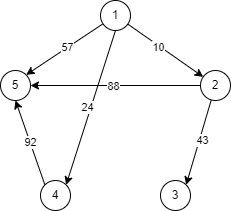
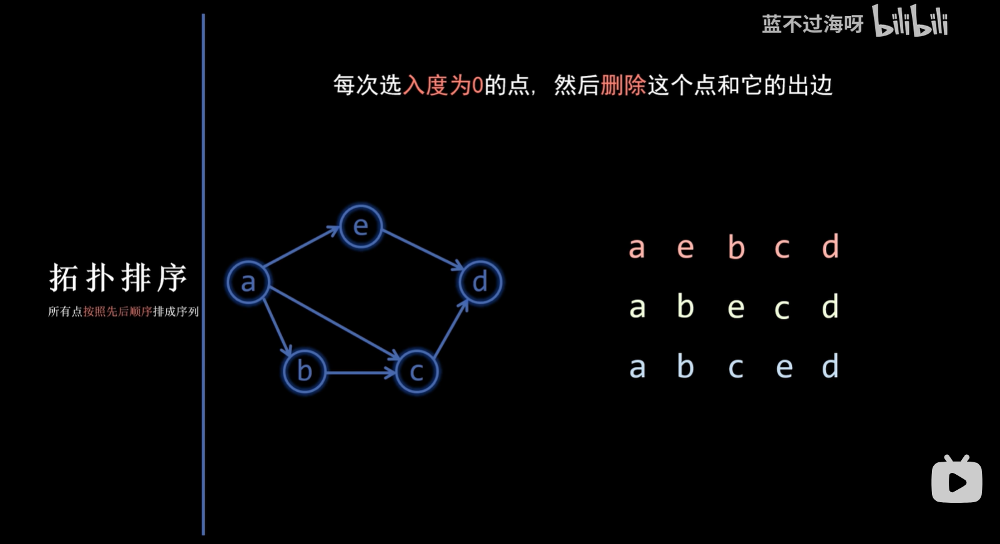

# 图论（基础）

- [图论部分简介](https://oi-wiki.org/graph/tree-basic/)

- [图论相关概念](https://oi-wiki.org/graph/concept/)

## [数组模拟邻接表](code/adjacency-list.cpp)

邻接表是一种用于表示图的数据结构，它通过链表的方式存储每个顶点的邻接顶点。邻接表在存储稀疏图时非常高效，因为它只存储实际存在的边，而不是像邻接矩阵那样存储所有可能的边。

### 邻接表的存储原理

邻接表的核心思想是为图中的每个顶点维护一个链表，链表中存储与该顶点直接相连的所有顶点。具体来说：

1. **顶点数组**：使用一个数组（如 `head`）来存储每个顶点的链表头指针。
2. **边链表**：使用一个链表（如 `edge` 数组）来存储所有的边。每条边包含目标顶点、边的权重以及指向下一条边的指针。

### 代码中的数组和变量作用

1. **`Node` 结构体**：
   - `int to`：表示边的目标顶点。
   - `int w`：表示边的权重。
   - `int next`：表示下一条边的索引（在 `edge` 数组中的位置）。

2. **`edge` 数组**：
   - 这是一个存储所有边的数组。每个元素是一个 `Node` 结构体，表示一条边。
   - 有向图的每条边会被存储一次（仅为 `u -> v`）。
   - 无向图的每条边会被存储两次（一次为 `u -> v`，一次为 `v -> u`）。

3. **`head` 数组**：
   - 这是一个大小为 `N` 的数组，用于存储每个顶点的第一条边的索引。
   - `head[u]` 存储顶点 `u` 的第一条边的索引。如果 `head[u]` 为 `-1`，表示顶点 `u` 没有邻接边。

通过这种方式，邻接表能够高效地表示和操作图结构。

---



- 样例数据：

    ```in
    6
    1 2 10
    1 4 24
    2 3 43
    1 5 57
    4 5 92
    2 5 88
    ```

- 有向图：

    ```out
    Node 1:
    -> 5 (weight: 57)
    -> 4 (weight: 24)
    -> 2 (weight: 10)
    Node 2:
    -> 5 (weight: 88)
    -> 3 (weight: 43)
    Node 3:
    Node 4:
    -> 5 (weight: 92)
    Node 5:
    ```

- 无向图：

    ```out
    Node 1:
    -> 5 (weight: 57)
    -> 4 (weight: 24)
    -> 2 (weight: 10)
    Node 2:
    -> 5 (weight: 88)
    -> 3 (weight: 43)
    -> 1 (weight: 10)
    Node 3:
    -> 2 (weight: 43)
    Node 4:
    -> 5 (weight: 92)
    -> 1 (weight: 24)
    Node 5:
    -> 2 (weight: 88)
    -> 4 (weight: 92)
    -> 1 (weight: 57)
    ```


---

### 说明

- **真正的邻接表**：使用指针和动态内存分配，更符合传统的链表实现。
- **数组模拟链表**：使用数组和索引来模拟链表，避免了动态内存分配的开销，通常在竞赛编程中更受欢迎。

## 图的深度优先搜索

- [树基础](https://oi-wiki.org/graph/tree-basic/)

### 1. 子树大小

```cpp
#include <iostream>
#include <vector>
using namespace std;
vector<int> G[110];
int sz[110];
int dfs(int u, int fa) {
    for (int i = 0; i < G[u].size(); i++) {
        int v = G[u][i];
        if (v != fa) {
            sz[u] += dfs(v, u);
        }
    }
    sz[u]++;
    return sz[u];
}
int main() {
    int n;
    cin >> n;
    for (int i = 0; i < n - 1; i++) {
        int u, v;
        cin >> u >> v;
        G[u].push_back(v);
        G[v].push_back(u);
    }
    dfs(1, 0);
    for (int i = 1; i <= n; i++) {
        cout << i << " " << sz[i] << endl;
    }
    return 0;
}
```

### 2. 最大连通块

```cpp
#include <cstdio>
#include <iostream>
#include <algorithm>
#include <vector>
using namespace std;
const int N = 20005;
int n, m, cnt, ans;
bool vis[N];
vector<int> G[N];
void dfs(int u) {
    cnt++;
    vis[u] = true;
    for (int i = 0; i < G[u].size(); i++) {
        int v = G[u][i];
        if (!vis[v]) {
            dfs(v);
        }
    }
}
int main() {
    cin >> n >> m;
    for (int i = 0; i < m; i++) {
        int u, v;
        cin >> u >> v;
        G[u].push_back(v);
        G[v].push_back(u);
    }
    for (int i = 1; i <= n; i++) {
        if (!vis[i]) {
            cnt = 0;
            dfs(i);
            ans = max(ans, cnt);
        }
    }
    cout << ans << endl;
    return 0;
}
```

## 最短路径算法

| 最短路算法 | Floyd | Bellman–Ford | Dijkstra | Johnson |
| --- | --- | --- | --- | --- |
| 最短路类型 | 全源最短路 | 单源最短路 | 单源最短路 | 全源最短路 |
| 作用于 | 任意图 | 任意图 | 非负权图 | 任意图 |
| 检测负环 | 能 | 能 | 不能 | 能 |
| 时间复杂度   | $O(N^3)$ | $O(NM)$ | $O(M\log M)$ | $O(NM\log M)$ |

- [最短路](https://oi-wiki.org/graph/shortest-path/)

### 1. [Floyd 多源最短路算法](code/floyd.cpp)

```cpp
for (int k = 1; k <= n; k++) { // 中间点
    for (int i = 1; i <= n; i++) { // 起点
        for (int j = 1; j <= n; j++) { // 终点
            g[i][j] = min(g[i][j], g[i][k] + g[k][j]);
        }
    }
}
```

### 2. [Dijkstra 最短路算法](code/dijkstra.cpp)

数据示例：

```in
6 7
1 2 2
1 3 4
2 3 1
2 4 7
3 5 3
4 6 1
5 6 5
1
```

对应输出：

```out
从起点 1 到各点的最短路径：
到 1 的最短距离: 0
路径为: 1
到 2 的最短距离: 2
路径为: 1 -> 2
到 3 的最短距离: 3
路径为: 1 -> 2 -> 3
到 4 的最短距离: 9
路径为: 1 -> 2 -> 4
到 5 的最短距离: 6
路径为: 1 -> 2 -> 3 -> 5
到 6 的最短距离: 10
路径为: 1 -> 2 -> 4 -> 6
```

```cpp
for (int i = 1; i <= n; i++) {
    int mind = inf; // 这一次的最小距离
    int v = 0; // 这一次最近的点
    for (int j = 1; j <= n; j++) {
        if (!vis[j] && d[j] < mind) { // 找到没有用过的最近的点
            mind = d[j];
            v = j;
        }
    }
    if (mind == inf) { // 如果最小距离是 inf 就说明剩下的点都不跟起点连通
        break;
    }
    vis[v] = true; // 把这一次的点标记
    for (int j = 0; j < g[v].size(); j++) { // 更新最短距离
        d[g[v][j].v] = min(d[g[v][j].v], d[v] + g[v][j].w);
    }
}
```

```cpp
set<pair<int, int> > min_heap;
min_heap.insert(make_pair(0, s));
while (min_heap.size()) {
    int mind = min_heap.begin() -> first; // 取出最小距离
    int v = min_heap.begin() -> second; // 取出最近的点
    min_heap.erase(min_heap.begin()); // 删除首元素
    for (int i = 0; i < g[v].size(); i++) {
        if (d[g[v][i].v] > d[v] + g[v][i].w) { // 更新
            min_heap.erase(make_pair(d[g[v][i].v], g[v][i].v)); // 先删除原来的元素
            d[g[v][i].v] = d[v] + g[v][i].w; // 更新距离
            min_heap.insert(make_pair(d[g[v][i].v], g[v][i].v)); // 加入新的元素
        }
    }
}
```

```cpp
priority_queue <pair<int, int>, vector<pair<int, int> >, greater<pair<int, int> > > min_heap;
min_heap.push(make_pair(0, s));
while (min_heap.size()) {
    int mind = min_heap.top().first;
    int v = min_heap.top().second;
    min_heap.pop();
    if (mind != d[v]) { // 如果距离被更新了不再是这个元素的距离了，那么就不用考虑这个元素了
        continue;
    }
    for (int i = 0; i < g[v].size(); i++) {
        if (d[g[v][i].v] > d[v] + g[v][i].w) { // 更新
            d[g[v][i].v] = d[v] + g[v][i].w;
            min_heap.push(make_pair(d[g[v][i].v], g[v][i].v)); // 把新元素放入优先队列
        }
    }
}
```

### 3. [Dijkstra 次短路算法](code/dijkstra-second.cpp)

### 4. [SPFA 单源最短路算法](code/SPFA.cpp)

```cpp
bool in_queue[MAX_N];
int d[MAX_N];  // 如果到顶点 i 的距离是 0x3f3f3f3f，则说明不存在源点到 i 的最短路
queue<int> q;
void spfa(int s) {
    memset(in_queue, 0, sizeof(in_queue));
    memset(d, 0x3f, sizeof(d));
    d[s] = 0;
    in_queue[s] = true; // 标记 s 入队
    q.push(s);
    while (!q.empty()) {
        int v = q.front();
        q.pop();
        in_queue[v] = false;
        for (int i = 0; i < g[v].size(); i++) {
            int x = g[v][i].v;
            if (d[x] > d[v] + g[v][i].w) { // 更新
                d[x] = d[v] + g[v][i].w;
                if (!in_queue[x]) { // 如果之前没入队
                    q.push(x); // 入队
                    in_queue[x] = true; // 标记 x 入队
                }
            }
        }
    }
}
```

## 不带权图算法



> 图片截取于： [图-拓扑排序](https://www.bilibili.com/video/BV1XV411X7T7) 作者：[蓝不过海呀](https://space.bilibili.com/401399175)

### 1. 实现拓扑排序

```cpp
#include <iostream>
#include <vector>
#include <queue>
using namespace std;
const int N = 105;
vector<int> g[N];
int indegree[N];
int n, m;
queue<int> q;
void topo() {
    for (int i = 1; i <= n; i++) {
        if (indegree[i] == 0) {
            q.push(i);
        }
    }
    while (!q.empty()) {
        int now = q.front();
        cout << now << endl;
        q.pop();
        for (int i = 0; i < g[now].size(); i++) {
            int v = g[now][i];
            indegree[v]--;
            if (indegree[v] == 0) {
                q.push(v);
            }
        }
    }
}

int main() {
    cin >> n >> m;
    for (int i = 0; i < m; i++) {
        int u, v;
        cin >> u >> v;
        g[u].push_back(v);
        indegree[v]++;
    }
    topo();
    return 0;
}
```

### 2. [NOIP 2013] 车站分级

```cpp
#include <iostream>
#include <cstring>
#include <algorithm>
#include <vector>
#include <queue>
using namespace std;
const int N = 1005;
vector<int> g[N];
int indegree[N];
int n, m;
queue<int> q;
int station[N], level[N];
bool f[N][N];
bool is_station[N];
void topo() {
    for (int i = 1; i <= n; i++) {
        if (indegree[i] == 0) {
            q.push(i);
            level[i] = 1;
        }
    }
    while (!q.empty()) {
        int now = q.front();
        q.pop();
        for (int i = 0; i < g[now].size(); i++) {
            int v = g[now][i];
            indegree[v]--;
            level[v] = max(level[v], level[now] + 1);
            if (indegree[v] == 0) {
                q.push(v);
            }
        }
    }
}
int main() {
    cin >> n >> m;
    for (int i = 0; i < m; i++) {
        int s;
        cin >> s;
        memset(is_station, false, sizeof(is_station));
        for (int j = 0; j < s; j++) {
            cin >> station[j];
            is_station[station[j]] = true;
        }
        for (int j = station[0]; j <= station[s - 1]; j++) {
            if (!is_station[j]) {
                for (int k = 0; k < s; k++) {
                    if (!f[j][station[k]]) {
                        g[j].push_back(station[k]);
                        f[j][station[k]] = true;
                        indegree[station[k]]++;
                    }
                }
            }
        }
    }
    topo();
    int ans = 0;
    for (int i = 1; i <= n; i++) {
        ans = max(ans, level[i]);
    }
    cout << ans << endl;
    return 0;
}
```

## 树的基础算法

### 1. 最小生成树算法

- [实现 Kruskal 算法](code/mst-kruskal.cpp)

- [ ] [实现 Prim 算法](code/mst-prim.cpp)

### 2. 求树的直径

- [树的直径](https://oi-wiki.org/graph/tree-diameter/)

- [实现求树的直径](code/tree-diameter.cpp)

### 3. 求树的重心

- [树的重心](https://oi-wiki.org/graph/tree-centroid/)

- [实现求树的重心](code/tree-centroid.cpp)

- [ ] [带权树的重心](https://www.luogu.com.cn/article/glqqp5lh)

## 最近公共祖先问题

### ST 表（倍增思想）

$f(i,j)$ 表示区间 $[i,i+2^j-1]$ 的最大值。

$f(i,0)=a_i$

$f(i,j)=\max\{f(i,j-1),\ f(i+2^{j-1},j-1)\}$

对于每个询问 $[l,r]$，我们把它分成两部分：$[l,l+2^s-1]$ 与 $[r-2^s+1,r]$，其中 $s=\lfloor {\log_2(r-l+1)}\rfloor $。两部分的结果的最大值就是回答。

- [ST 表](https://oi-wiki.org/ds/sparse-table/)

- [实现 ST 算法](code/sparse-table.cpp)

### LCA 倍增解法

- [最近公共祖先](https://oi-wiki.org/graph/lca/)

- [LCA 倍增解法的实现](code/lowest-common-ancestor.cpp)

- [ ] Tarjan 算法
